# Off the Chart

**Your chart says what's wrong. Off the Chart says how to talk to you.**

Off the Chart is a care-team console that turns a patient's chart and their own "what matters to you" check-in into a Persona Profile and a Voice Guide, then writes every automated touchpoint for that person: appointment messages, a plain-language visit summary, a captioned prep video, and a 30-second clinician brief. A rules-based checker scores the clinic's current template and the new version by the same eight rules, every claim cites its source in the record, guesses are labeled, and a clinician approves before anything goes out.

**Every patient, note, visit, staff account and message in this repository is synthetic.** The EHR records come from [sparkcpark/synthetic_hospital](https://huggingface.co/datasets/sparkcpark/synthetic_hospital) (MIT). Names, caregivers, upcoming visits and check-ins are seeded. Sending is simulated.

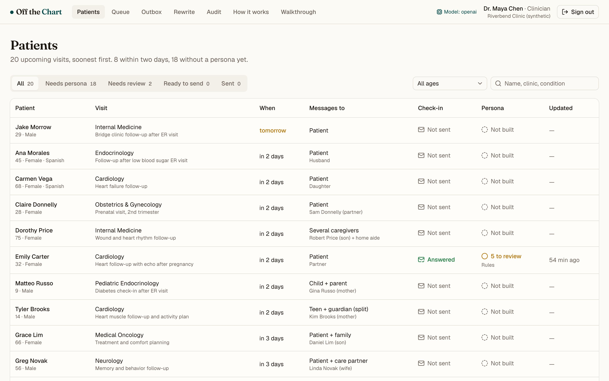

## What

A work queue of upcoming visits, a workbench per patient, and an approval path with an audit trail.

**Patients.** Soonest visit first, with who the messages go to, whether the patient has answered the check-in, and where the persona stands: not built, to review, approved, or sent. Filter by stage or age band, or search.

**Workbench.** The chart on the left, the patient-stated check-in on the right. "Build Persona" runs four visible stages: extract facts (rules), Persona Profile (model), Voice Guide (model), render touchpoints (model), then check and score (rules). Each stage is labeled live, cached, or rules-based fallback.

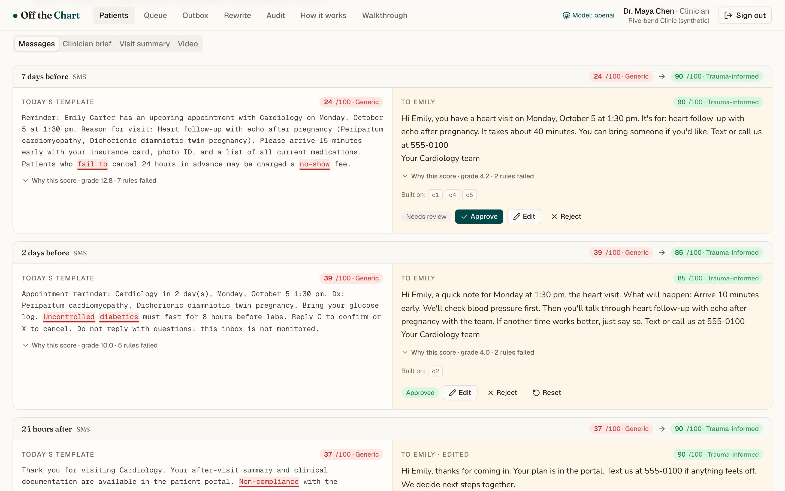

**Messages.** Today's template beside the person's version at three moments (7 days before, 2 days before, 24 hours after). Each is scored 0 to 100 with every rule that fired, and flagged terms carry a suggested replacement. A teen with confidential care gets a separate guardian copy with the private parts kept out.

**Evidence.** Every claim on the Persona Profile is a chip. Open it and the sheet points at the encounter and field, or at the patient's own words. Inferred claims must be confirmed before a message that relies on them can be approved.

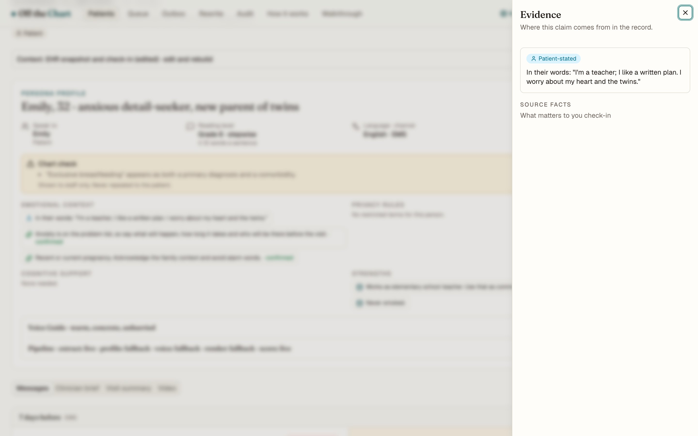

**Clinician brief.** Five to seven lines to read before walking in: who the person is, how to talk to them, what matters in their words, what to avoid, and any chart contradiction. Read it aloud with a studio voice (ElevenLabs when configured, otherwise the browser's own).

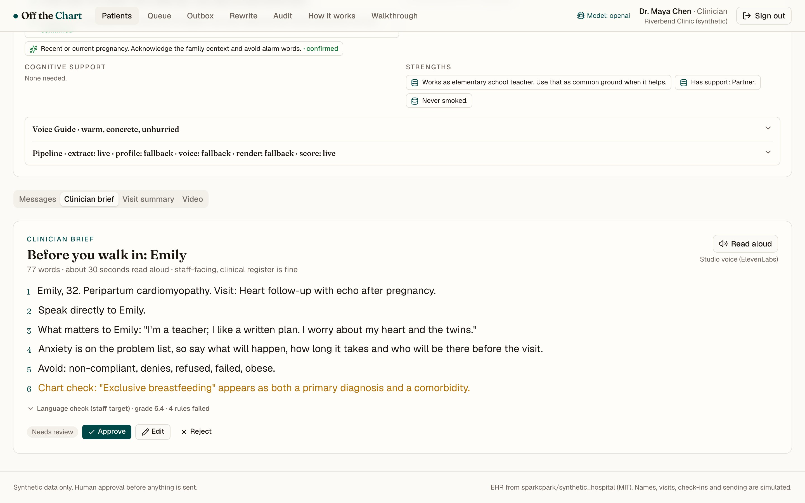

**Visit summary and video.** The after-visit summary in the patient's voice at their reading level, printable. A short captioned video rendered in the browser with Remotion, narrated by the same voice. It plays like an illustrated explainer: a comic greeting scene picked by age band, one picture per idea (calendar, blood pressure check, echo, phone call), and a numbered flow for the steps. Pictures are chosen from each scene's own words, in English or Spanish, and never by race or ethnicity.

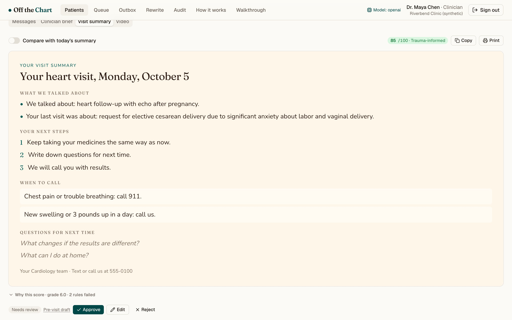
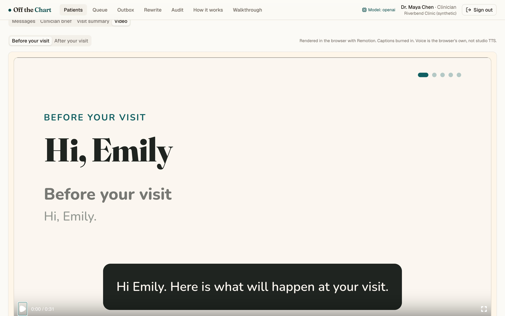

**Check-in.** A coordinator creates a link; the patient or caregiver answers four questions without signing in, in English or Spanish. The answers flow into the next build as patient-stated claims.

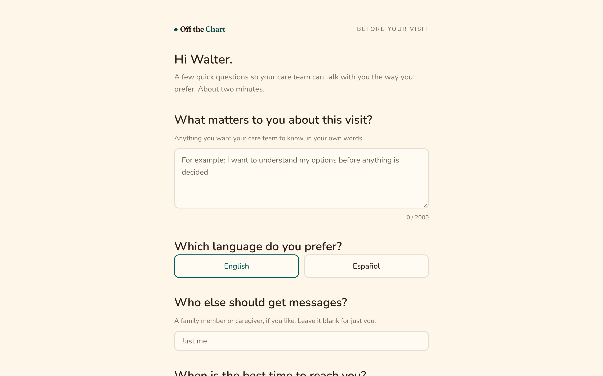

**Queue, outbox, audit.** Pending touchpoints across patients for a clinician to approve, edit or reject. Approved items queue in the outbox, where sending is simulated and privacy is re-checked; after-visit drafts cannot send until the visit has happened. Every decision is on record with ids and counts, never text.

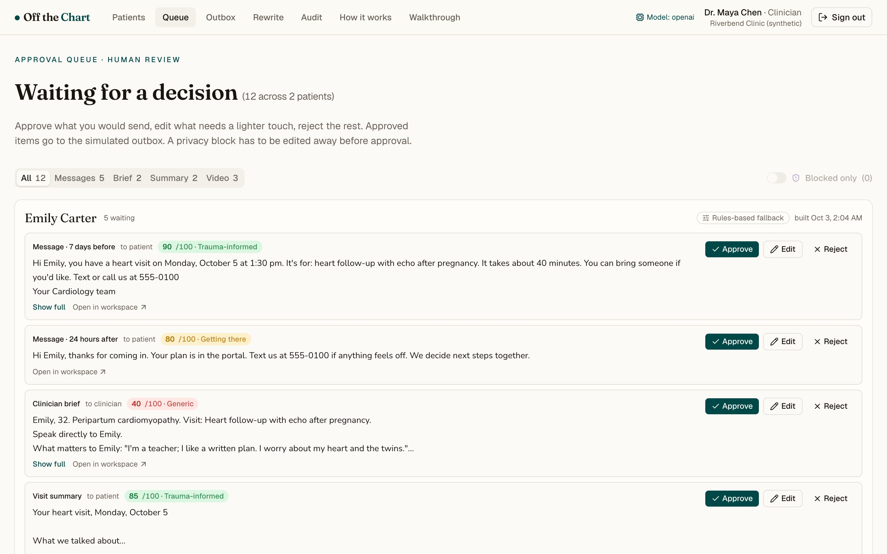
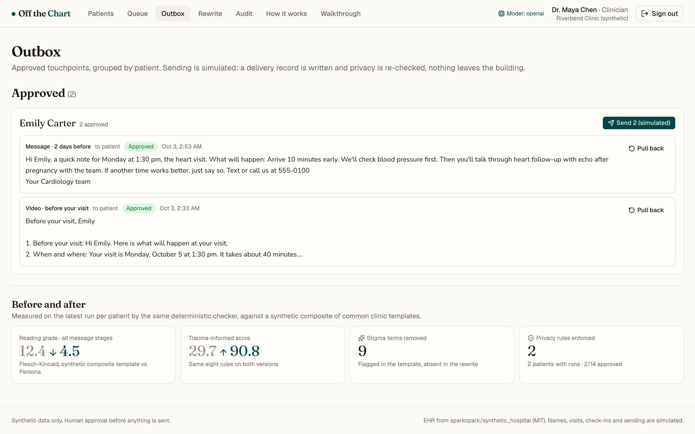
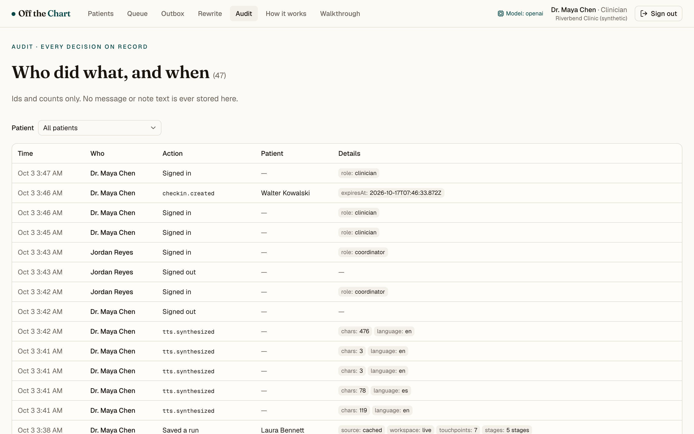

**Guided walkthrough.** A 14-step tour through Emily (ideal), Walter (complex) and Jake (edge), replaying cached output in its own data workspace with a reset that never touches real work. Off in production unless `OFF_THE_CHART_DEMO=1`.

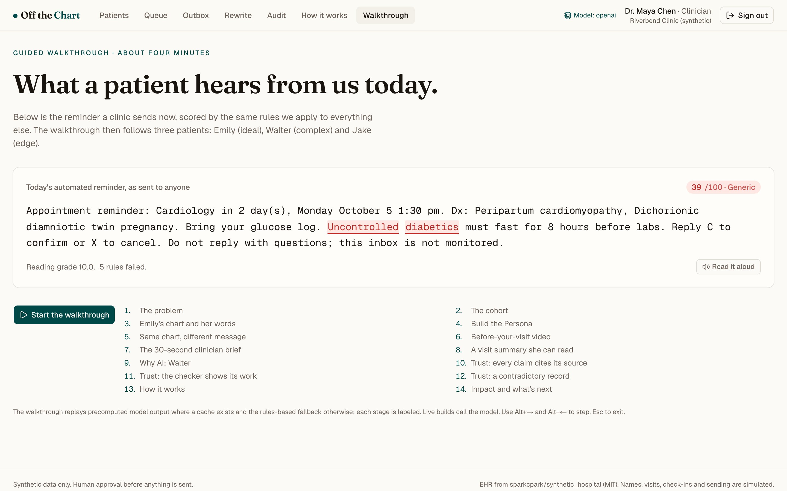

<p>
  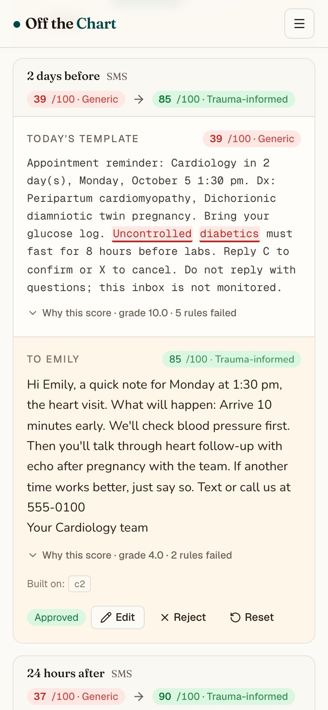
</p>

## Why

Automated reminders and AI scribes produce one-size-fits-all text, such as "Reminder: appointment in 2 days. Reply C to confirm." That text ignores who is reading: a teen whose mental-health care is confidential, a dementia caregiver, a patient in recovery who has been judged before, or someone sharing a phone. Generic or stigmatizing language erodes trust and adherence, and staff rewrite messages by hand only when they have time.

Off the Chart decides tone, audience, reading level and privacy rules once per patient, with evidence, and enforces them on every output. The model does the synthesis a mail-merge can't; rules do the scoring and the enforcement so the system can show its work; a person approves.

Three things the demo proves:

1. The same chart becomes a visibly different, better message for different people, with a score computed by the same rules on both.
2. Every clinical statement traces back to the record, and guesses are labeled.
3. One engine produces messages, summary, video and brief consistently.

Not claimed: clinical validation or regulatory compliance. A pilot would measure no-shows, portal engagement and teach-back comprehension.

## Who

| Role | What they do here |
| --- | --- |
| **Care coordinator** | Picks the patient, sends the check-in link, builds the persona, edits touchpoints, sends them to the queue. Cannot approve. |
| **Clinician** | Reads the brief, confirms inferred claims, approves or rejects, sends from the outbox. |
| **Patient or caregiver** | Answers the check-in in their own words; receives messages written for them. Never sees the console. |
| **Admin** | Both staff roles. |

Seeded development accounts for each role are offered on the sign-in page outside production.

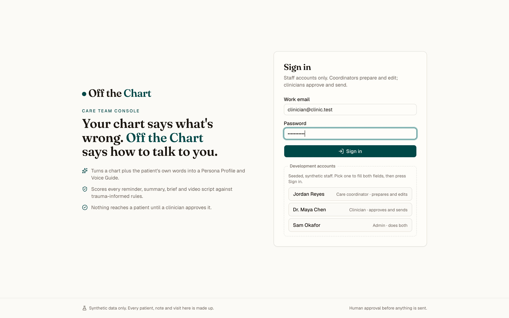

## Setup

Requires Node 22 and pnpm.

```bash
pnpm install
cp .env.example .env.local   # then set keys (all optional)
pnpm dev
```

Open http://localhost:3000, which shows the public landing page; sign in with a seeded development account from the quick-fill buttons to reach the console at `/patients`. Set `MONGODB_URI` first (Atlas or a local `mongod`); collections and indexes are created on the first request.

### Environment variables

| Variable | Purpose |
| --- | --- |
| `ANTHROPIC_API_KEY` | Claude. Preferred when set. Default model `claude-opus-5-5`. |
| `OPENAI_API_KEY` | OpenAI, used when no Anthropic credential is set. Default model `gpt-4.1` (`OPENAI_MODEL` to override). |
| `OFF_THE_CHART_PROVIDER` | Force `anthropic` or `openai` when both keys exist. |
| `OFF_THE_CHART_STAGE_TIMEOUT_MS` | Per-stage model timeout (default 90000). |
| `ELEVENLABS_API_KEY`, `ELEVENLABS_VOICE_ID` | Studio voice for read-aloud and video narration, cached in `data/audio/`. Without it, the browser voice is used. |
| `MONGODB_URI` | Required. MongoDB connection string (Atlas in production). `MONGODB_DB` overrides the database name (default `offthechart`). |
| `SEED_PASSWORD` | Password for the seeded staff accounts. Defaults to a dev value outside production; required in production. |
| `OFF_THE_CHART_QUICK_SIGNIN` | `1` shows one-click sign-in buttons for the seeded coordinator and clinician on the sign-in page, for a public demo. Admin always needs the password; no password is sent to the browser. |
| `OFF_THE_CHART_CHECKIN_EXTRA_QUESTIONS` | `1` adds language, who else should get messages, and best time to reach them to the patient check-in form. Default: off, and the form asks only what support they need. |
| `OFF_THE_CHART_DEMO` | `1`/`0` to force the guided walkthrough on or off. Default: on outside production. |

Without a model key the app still works: builds use the committed cached output for that patient, otherwise the rules-based fallback, and the UI labels both.

### Commands

```bash
pnpm dev            # dev server
pnpm build          # production build
pnpm typecheck      # tsc --noEmit
pnpm lint           # eslint
pnpm test           # vitest (checker, pipeline, check-in helpers)
pnpm precompute     # regenerate src/lib/data/generated/<id>.json with the live model (retries on rate limits)
pnpm precompute --check   # fail if any of the 20 patients lacks a valid cached file (no model calls)
pnpm gen-scenes    # regenerate missing video illustrations in public/video with the OpenAI image API (--force to redo)
```

## How the engine works

```
EHR record ─► extract facts (rules) ─► Persona Profile (model, schema-checked)
           ─► Voice Guide (model) ─► 4 renderers (model) ─► checker (rules) ─► clinician approval
```

- The render stage sees only the profile, the voice guide and cited facts, never the raw note. Facts named in a chart-check warning are withheld from it.
- After every model stage, code verifies provenance: a "fact" claim without a cited fact is downgraded to "inferred"; claim references that point nowhere are dropped.
- Fallback chain per model stage: live call (one retry on a schema miss) → cached output for that patient → rules-based templates. Never a blank screen.
- The checker allocates 100 points across eight rules: privacy (blocking), stigma lexicon with replacements, reading grade (Flesch-Kincaid, Fernández-Huerta for Spanish), sentence length, choice, predictability, safety, collaboration. Details in `src/lib/ti-checker/score.ts`.
- Privacy is enforced three times: at approval, at send, and in the text itself (the fallback scrubs restricted terms; the model is told the rule and checked anyway).

## Real vs simulated

| Real | Simulated |
| --- | --- |
| The EHR records (synthetic dataset, used as-is) | Names, caregivers, upcoming visits, check-ins |
| Model generation, schema validation, provenance checks | Sending: the outbox writes delivery records, nothing leaves |
| The trauma-informed scoring, approval state, audit | Staff accounts (seeded) |
| Read-aloud and video voice: ElevenLabs when configured, else browser speech | MP4 export (not built) |

## Stack

Next.js 16 (App Router), TypeScript, Tailwind v4, shadcn/ui, MongoDB (official Node driver), Remotion player, Zod, Vitest. Models: Claude (`@anthropic-ai/sdk`, structured outputs) or OpenAI (chat completions with JSON schema) behind one adapter. Everything else is rules.

## Roadmap

See `docs/PLAN.md`. Next: FHIR Communication/Appointment integration in front of reminder vendors, a patient-editable persona, and outcome measurement.

## License

MIT. See `LICENSE`.
